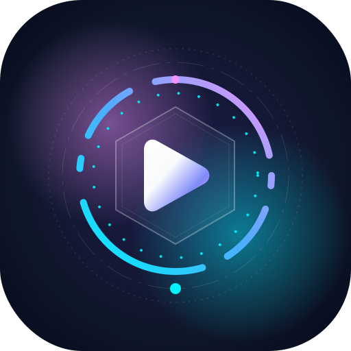

<div align="center">
  
  
  # HOA Video Player
  
  **The Most Advanced, Professional, and Feature-Rich Offline Video Player for Android.**
  
  <p align="center">
    <a href="https://android.com"></a>
    <a href="https://kotlinlang.org"></a>
    <a href="https://developer.android.com/jetpack/compose"></a>
    <a href="#"></a>
    <a href="#"></a>
  </p>
</div>

---

**HOA Video Player** is a highly advanced, ultra-lightweight Android Video Player built entirely with Kotlin, Jetpack Compose, and Media3 ExoPlayer. Designed with a focus on immersive user experiences, it features stunning **Material 3 aesthetics**, seamless **glassmorphism overlays**, an incredibly intuitive **single-row compact control layout**, and **on-device smart features**.

This application operates 100% entirely offline. No cloud APIs, no backend, no data harvesting. Your privacy is absolutely guaranteed.

---

## ✨ Standout Features

### 🧠 Advanced AI & Smart Features
*   **Intelligent Thumbnail Engine:** Extracts multiple candidate frames across the video and uses luminance variance heuristics to automatically select the most visually engaging thumbnail.
*   **Smart Folder Library:** Features a beautiful masonry 2x2 grid displaying dynamic folder previews.
*   **Intelligent Storage Dashboard:** Real-time analysis of storage capacity, categorizing sizes natively.

### 🎬 Core Playback Experience
*   **Media3 ExoPlayer Integration:** High-performance, low-latency video playback for almost all major formats.
*   **Immersive Edge-to-Edge Display:** 90% of the screen is dedicated to the video. The System UI intelligently auto-hides.
*   **Picture-in-Picture (PiP):** Seamlessly transition to PiP mode when leaving the app.
*   **Smart Folder Navigation:** Browse and play local videos effortlessly with an integrated folder playlist system. 
*   **Auto Play Next:** Playlists are auto-queued; jump seamlessly to the next or previous video in the directory.

### 🎛 Advanced Player Capabilities
*   **A-B Repeat:** Continuously loop a specific segment of the video (Point A to Point B) for studying or detailed viewing.
*   **Persistent Bookmarks & Chapters:** Save timestamps directly to the local database. Bookmarks are retained even after the app is closed.
*   **Subtitles Support:** Load and switch between subtitle tracks effortlessly.
*   **Video Transformations:**
    *   Dynamic Resize Modes (Fit, Fill, Zoom)
    *   Video Mirroring & Flipping
    *   360-degree arbitrary Rotation (Z-axis)
*   **Gesture Controls:**
    *   **Swipe Vertical (Left):** Adjust Screen Brightness.
    *   **Swipe Vertical (Right):** Adjust Audio Volume.
    *   **Swipe Horizontal:** Seek forward and backward with precise visual feedback.
*   **Security Controls:** One-tap UI Lock button to freeze all gestures and prevent accidental touches.

### 🎨 UI & Aesthetics
*   **Compact Single-Row Controller:** `[Prev] [Play] [Next] [Time] [Slider] [Duration] [Fullscreen]` logic that saves massive amounts of screen real estate.
*   **Glassmorphism Effects:** Beautiful 80% transparent blur effects utilized throughout the UI (More Menus, Bottom Sheets, Settings, etc.).
*   **Material 3 Dynamic Theming:** Adapts to modern Android design standards with premium animations.

### 🛡 Stability & Reporting
*   **Intelligent Crash Handler:** If the app ever crashes, a beautiful custom recovery screen is launched.
*   **Rapid Bug Reporting:** Export crash logs to the clipboard, instantly send them via WhatsApp, or auto-generate a GitHub issue ticket.

---

## 🛠 Tech Stack & Architecture
This project rigorously adheres to a **Modular Domain-Driven Architecture**. Every file is self-descriptive and incredibly lightweight. 

*   **Language:** Kotlin
*   **UI Toolkit:** Jetpack Compose (Edge-to-Edge Enabled)
*   **Architecture:** MVVM (Model-View-ViewModel) with Kotlin Coroutines & StateFlow
*   **Dependency Injection:** Hilt / Dagger
*   **Video Engine:** AndroidX Media3 (ExoPlayer) with `MediaSessionService` support
*   **Local Storage:** Room Database (for Watch History, Bookmarks, and Chapters)
*   **Image Loading:** Coil (with VideoFrameDecoder hardware support)

---

## 📦 Prerequisites
Before building the project, ensure you have the following installed:

- **Android Studio** Jellyfish (2023.3.1) or newer
- **JDK 11** (required; the project targets `jvmTarget = "11"`)
- **Android SDK** with API Level 36 (`compileSdk = 36`, `targetSdk = 36`)
- **Python 3** (for running the AAR download script; optional — see Step 2 below)

## 🛠️ Required Manual Setup

This project requires a few manual steps before it will compile and run correctly. Follow each step below **before** opening the project in Android Studio.

### 1. Create `local.properties`

This file is **not** committed to the repository. You must create it manually in the project root.

Create a file named `local.properties` in the project root directory (`C:\Users\rajib\Desktop\vidplay\`) with the following content:

```properties
## Android SDK location — adjust this to match your system
sdk.dir=C\:\\Users\\[YOUR_USERNAME]\\AppData\\Local\\Android\\Sdk

## AdMob IDs — use Google's test IDs for development, or your real production IDs for release
ADMOB_APP_ID=ca-app-pub-3940256099942544~3347511713
ADMOB_BANNER_ID=ca-app-pub-3940256099942544/6300978111
ADMOB_INTERSTITIAL_ID=ca-app-pub-3940256099942544/1033173712
ADMOB_REWARDED_ID=ca-app-pub-3940256099942544/5354046379
ADMOB_NATIVE_ID=ca-app-pub-3940256099942544/2247696110
```

> **⚠️ Important:** Replace `[YOUR_USERNAME]` with your actual Windows username. The AdMob IDs shown above are **Google's official test IDs** — safe for development. For production release builds, replace them with your real AdMob unit IDs from the Google AdMob console.

**Windows path note:** use double backslashes (`\\`) as shown above, or single forward slashes (`/`).

### 2. Download FFmpegKit AAR

The video editing features (Trim, Merge, Extract Audio, Compress, Convert, GIF Maker, Screenshots, Scene Detection, Quality Analyzer, etc.) depend on **FFmpegKit**. This library is not available on Maven Central — you must download its `.aar` file and place it manually.

**Option A: Run the download script (recommended)**

```bash
python download_aar.py
```

This script fetches the latest `ffmpeg-kit-min-gpl` AAR from GitHub and places it in `app/libs/ffmpeg-kit.aar`.

> **Note:** If the script fails (GitHub API changes, network issues), use Option B.

**Option B: Manual download**

1. Go to the [FFmpegKit releases page](https://github.com/arthenica/ffmpeg-kit/releases)
2. Download the latest `ffmpeg-kit-min-gpl` AAR for Android (e.g., `ffmpeg-kit-min-gpl-6.0-2.LTS.aar`)
3. Rename it to `ffmpeg-kit.aar`
4. Place it in the `app/libs/` directory

### 3. Register the AAR in `app/build.gradle.kts`

Add the following line inside the `dependencies { }` block of `app/build.gradle.kts` (place it near the other `implementation(...)` lines):

```kotlin
// FFmpegKit AAR (local library)
implementation(fileTree(mapOf("dir" to "libs", "include" to listOf("*.aar"))))
```

### 4. Remove the Mock FFmpegKit Class

Once the real AAR is in place, you **must delete** the mock/stub file that currently allows the code to compile without the AAR. Without this deletion, the code will still compile but **FFmpeg features will silently do nothing**.

**Delete this file:**
```
app/src/main/java/com/arthenica/ffmpegkit/FFmpegKit.kt
```

You can also delete the empty `com/arthenica/ffmpegkit/` directory after removing the file.

### 5. Verify Setup

Before opening in Android Studio, confirm:
- [ ] `local.properties` exists with correct `sdk.dir` and AdMob IDs
- [ ] `app/libs/ffmpeg-kit.aar` exists (≈25–40 MB file)
- [ ] `app/build.gradle.kts` contains the `fileTree` AAR dependency line
- [ ] `app/src/main/java/com/arthenica/ffmpegkit/FFmpegKit.kt` has been **deleted**

### 6. Build the Project

```bash
./gradlew clean assembleDebug
```

Or open in Android Studio and let Gradle sync. The first sync may take several minutes as it downloads all dependencies (~200 MB).

---

## 📦 Building from Source (Quick Reference)

Once setup is complete:

1. Open the project in Android Studio (Jellyfish or newer recommended)
2. Let Gradle sync and resolve dependencies
3. Run the app on an emulator or physical device (Android 11+, API 30+)

```bash
./gradlew clean assembleDebug
```

---

## 🔒 Privacy Policy
At HOA Video Player, we respect your privacy. This application operates entirely offline and does not collect, store, or transmit any of your personal data or video metadata to any external servers. All video indexing, bookmarks, and chapters are stored securely on your local device.

## 📝 License
This project is licensed under the MIT License - see the LICENSE file for details.
